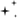
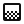
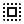
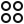

# SOLAR Icons

Source: Figma file `SOLAR Icons [v2--2026]` (key `f0slPVSjDnXgdyPmWOSVOw`), version `2402400024423705866`, last modified 2026-09-23, fetched 2026-09-24. 340 icons in 15 categories, 680 SVG variants (450 KB), 10 logo assets. Generated by `docs/solar-icons/build-docs.mjs`; regenerate with `npm run solar:icons`.

Every icon is a Figma component set `Icon/<Name>` with two variants, `solid=false` (outline) and `solid=true`, drawn on a 24 × 24 grid with one fill bound to the Foundations primitive `color/neutral/900`. Files live in [svg/outline/](svg/outline/) and [svg/solid/](svg/solid/) under the kebab-case name; `catalog.json` maps names to files and Figma ids. No findings.

## Navigation

33 icons. Figma page `5224:578`, raw data [raw/icons/navigation.json](raw/icons/navigation.json).

| Outline                                                                                                  | Solid                                                                                                | Figma name           | Component                | File stem              | Issues |
| -------------------------------------------------------------------------------------------------------- | ---------------------------------------------------------------------------------------------------- | -------------------- | ------------------------ | ---------------------- | ------ |
|               |               | `ChevronRight`       | `IconChevronRight`       | `chevron-right`        |        |
|                 |                 | `ChevronDown`        | `IconChevronDown`        | `chevron-down`         |        |
|                     |                     | `ChevronUp`          | `IconChevronUp`          | `chevron-up`           |        |
|                 |                 | `ChevronLeft`        | `IconChevronLeft`        | `chevron-left`         |        |
|            |            | `ChevronUpDown`      | `IconChevronUpDown`      | `chevron-up-down`      |        |
|                         |                         | `ArrowUp`            | `IconArrowUp`            | `arrow-up`             |        |
|                     |                     | `ArrowDown`          | `IconArrowDown`          | `arrow-down`           |        |
|                     |                     | `ArrowLeft`          | `IconArrowLeft`          | `arrow-left`           |        |
|                   |                   | `ArrowRight`         | `IconArrowRight`         | `arrow-right`          |        |
|                |                | `ArrowUpLeft`        | `IconArrowUpLeft`        | `arrow-up-left`        |        |
|              |              | `ArrowUpRight`       | `IconArrowUpRight`       | `arrow-up-right`       |        |
|            |            | `ArrowDownLeft`      | `IconArrowDownLeft`      | `arrow-down-left`      |        |
|          |          | `ArrowDownRight`     | `IconArrowDownRight`     | `arrow-down-right`     |        |
|        |        | `DoubleChevronUp`    | `IconDoubleChevronUp`    | `double-chevron-up`    |        |
|    |    | `DoubleChevronDown`  | `IconDoubleChevronDown`  | `double-chevron-down`  |        |
|    |    | `DoubleChevronLeft`  | `IconDoubleChevronLeft`  | `double-chevron-left`  |        |
|  |  | `DoubleChevronRight` | `IconDoubleChevronRight` | `double-chevron-right` |        |
|                                |                                | `Back`               | `IconBack`               | `back`                 |        |
|                                |                                | `More`               | `IconMore`               | `more`                 |        |
|                    |                    | `Breadcrumb`         | `IconBreadcrumb`         | `breadcrumb`           |        |
|               |               | `ExternalLink`       | `IconExternalLink`       | `external-link`        |        |
|                                |                                | `Home`               | `IconHome`               | `home`                 |        |
|                                |                                | `Menu`               | `IconMenu`               | `menu`                 |        |
|                        |                        | `Overflow`           | `IconOverflow`           | `overflow`             |        |
|             |             | `SortAscending`      | `IconSortAscending`      | `sort-ascending`       |        |
|           |           | `SortDescending`     | `IconSortDescending`     | `sort-descending`      |        |
|          |          | `CornerDownLeft`     | `IconCornerDownLeft`     | `corner-down-left`     |        |
|        |        | `CornerDownRight`    | `IconCornerDownRight`    | `corner-down-right`    |        |
|              |              | `CornerUpLeft`       | `IconCornerUpLeft`       | `corner-up-left`       |        |
|            |            | `CornerUpRight`      | `IconCornerUpRight`      | `corner-up-right`      |        |
|                 |                 | `AppSwitcher`        | `IconAppSwitcher`        | `app-switcher`         |        |
|                     |                     | `BackSpace`          | `IconBackSpace`          | `back-space`           |        |
|                         |                         | `PageNav`            | `IconPageNav`            | `page-nav`             |        |

## Actions

70 icons. Figma page `5224:579`, raw data [raw/icons/actions.json](raw/icons/actions.json).

| Outline                                                                                                | Solid                                                                                              | Figma name          | Component               | File stem             | Issues |
| ------------------------------------------------------------------------------------------------------ | -------------------------------------------------------------------------------------------------- | ------------------- | ----------------------- | --------------------- | ------ |
|                            |                            | `Check`             | `IconCheck`             | `check`               |        |
|                            |                            | `Close`             | `IconClose`             | `close`               |        |
|                              |                              | `Plus`              | `IconPlus`              | `plus`                |        |
|                            |                            | `Minus`             | `IconMinus`             | `minus`               |        |
|                              |                              | `Copy`              | `IconCopy`              | `copy`                |        |
|                          |                          | `Delete`            | `IconDelete`            | `delete`              |        |
|                      |                      | `Download`          | `IconDownload`          | `download`            |        |
|                 |                 | `DragHandle`        | `IconDragHandle`        | `drag-handle`         |        |
|                    |                    | `Duplicate`         | `IconDuplicate`         | `duplicate`           |        |
|                              |                              | `Edit`              | `IconEdit`              | `edit`                |        |
|                          |                          | `Filter`            | `IconFilter`            | `filter`              |        |
|                                |                                | `Pin`               | `IconPin`               | `pin`                 |        |
|                              |                              | `Redo`              | `IconRedo`              | `redo`                |        |
|                        |                        | `Refresh`           | `IconRefresh`           | `refresh`             |        |
|                              |                              | `Save`              | `IconSave`              | `save`                |        |
|                          |                          | `Search`            | `IconSearch`            | `search`              |        |
|                      |                      | `Settings`          | `IconSettings`          | `settings`            |        |
|                            |                            | `Share`             | `IconShare`             | `share`               |        |
|                              |                              | `Undo`              | `IconUndo`              | `undo`                |        |
|                            |                            | `Unpin`             | `IconUnpin`             | `unpin`               |        |
|                          |                          | `Upload`            | `IconUpload`            | `upload`              |        |
|                         |                         | `ZoomIn`            | `IconZoomIn`            | `zoom-in`             |        |
|                       |                       | `ZoomOut`           | `IconZoomOut`           | `zoom-out`            |        |
|               |               | `ColorPicker`       | `IconColorPicker`       | `color-picker`        |        |
|                                |                                | `Cut`               | `IconCut`               | `cut`                 |        |
|                          |                          | `Deploy`            | `IconDeploy`            | `deploy`              |        |
|                          |                          | `Export`            | `IconExport`            | `export`              |        |
|                          |                          | `Import`            | `IconImport`            | `import`              |        |
|                          |                          | `Locate`            | `IconLocate`            | `locate`              |        |
|                            |                            | `Paste`             | `IconPaste`             | `paste`               |        |
|                            |                            | `Print`             | `IconPrint`             | `print`               |        |
|                          |                          | `Reboot`            | `IconReboot`            | `reboot`              |        |
|               |               | `ScanBarcode`       | `IconScanBarcode`       | `scan-barcode`        |        |
|                              |                              | `Send`              | `IconSend`              | `send`                |        |
|               |               | `AlignCenter`       | `IconAlignCenter`       | `align-center`        |        |
|                   |                   | `AlignLeft`         | `IconAlignLeft`         | `align-left`          |        |
|                 |                 | `AlignRight`        | `IconAlignRight`        | `align-right`         |        |
|             |             | `AlignJustify`      | `IconAlignJustify`      | `align-justify`       |        |
|                              |                              | `Bold`              | `IconBold`              | `bold`                |        |
|                          |                          | `Italic`            | `IconItalic`            | `italic`              |        |
|                    |                    | `Underline`         | `IconUnderline`         | `underline`           |        |
|            |            | `Strikethrough`     | `IconStrikethrough`     | `strikethrough`       |        |
|                 |                 | `ListBullet`        | `IconListBullet`        | `list-bullet`         |        |
|             |             | `ListNumbered`      | `IconListNumbered`      | `list-numbered`       |        |
|                    |                    | `Sparkling`         | `IconSparkling`         | `sparkling`           |        |
|                    |                    | `Increment`         | `IconIncrement`         | `increment`           |        |
|                    |                    | `Decrement`         | `IconDecrement`         | `decrement`           |        |
|                          |                          | `Preset`            | `IconPreset`            | `preset`              |        |
|                          |                          | `Cursor`            | `IconCursor`            | `cursor`              |        |
|                              |                              | `Move`              | `IconMove`              | `move`                |        |
|                                |                                | `Pan`               | `IconPan`               | `pan`                 |        |
|                          |                          | `Rotate`            | `IconRotate`            | `rotate`              |        |
|                              |                              | `Snap`              | `IconSnap`              | `snap`                |        |
|                        |                        | `Measure`           | `IconMeasure`           | `measure`             |        |
|                 |                 | `GridToggle`        | `IconGridToggle`        | `grid-toggle`         |        |
|               |               | `PowerButton`       | `IconPowerButton`       | `power-button`        |        |
|                    |                    | `Transform`         | `IconTransform`         | `transform`           |        |
|                        |                        | `Ungroup`           | `IconUngroup`           | `ungroup`             |        |
|                              |                              | `Tune`              | `IconTune`              | `tune`                |        |
|                          |                          | `Design`            | `IconDesign`            | `design`              |        |
|                        |                        | `Palette`           | `IconPalette`           | `palette`             |        |
|                              |                              | `Fill`              | `IconFill`              | `fill`                |        |
|                      |                      | `Gradient`          | `IconGradient`          | `gradient`            |        |
|                   |                   | `SelectAll`         | `IconSelectAll`         | `select-all`          |        |
|      |      | `AlignObjectLeft`   | `IconAlignObjectLeft`   | `align-object-left`   |        |
|  |  | `AlignObjectCenter` | `IconAlignObjectCenter` | `align-object-center` |        |
|    |    | `AlignObjectRight`  | `IconAlignObjectRight`  | `align-object-right`  |        |
|        |        | `AlignObjectTop`    | `IconAlignObjectTop`    | `align-object-top`    |        |
|  |  | `AlignObjectMiddle` | `IconAlignObjectMiddle` | `align-object-middle` |        |
|  |  | `AlignObjectBottom` | `IconAlignObjectBottom` | `align-object-bottom` |        |

## Status & Feedback

17 icons. Figma page `5224:580`, raw data [raw/icons/status-feedback.json](raw/icons/status-feedback.json).

| Outline                                                                                                 | Solid                                                                                               | Figma name           | Component                | File stem             | Issues |
| ------------------------------------------------------------------------------------------------------- | --------------------------------------------------------------------------------------------------- | -------------------- | ------------------------ | --------------------- | ------ |
|                           |                           | `Danger`             | `IconDanger`             | `danger`              |        |
|                             |                             | `Empty`              | `IconEmpty`              | `empty`               |        |
|                  |                  | `HelpCircle`         | `IconHelpCircle`         | `help-circle`         |        |
|                               |                               | `Info`               | `IconInfo`               | `info`                |        |
|                           |                           | `Loader`             | `IconLoader`             | `loader`              |        |
|                               |                               | `None`               | `IconNone`               | `none`                |        |
|                         |                         | `Success`            | `IconSuccess`            | `success`             |        |
|                         |                         | `Warning`            | `IconWarning`            | `warning`             |        |
|                       |                       | `Priority`           | `IconPriority`           | `priority`            |        |
|                       |                       | `Progress`           | `IconProgress`           | `progress`            |        |
|                         |                         | `Support`            | `IconSupport`            | `support`             |        |
|                          |                          | `GoLive`             | `IconGoLive`             | `go-live`             |        |
|  |  | `RecordingIndicator` | `IconRecordingIndicator` | `recording-indicator` |        |
|              |              | `AlarmWarning`       | `IconAlarmWarning`       | `alarm-warning`       |        |
|               |               | `Unconfigured`       | `IconUnconfigured`       | `unconfigured`        |        |
|                       |                       | `Infinity`           | `IconInfinity`           | `infinity`            |        |
|                    |                    | `NoResults`          | `IconNoResults`          | `no-results`          |        |

## Content & Media

30 icons. Figma page `5224:581`, raw data [raw/icons/content-media.json](raw/icons/content-media.json).

| Outline                                                                                 | Solid                                                                               | Figma name   | Component        | File stem     | Issues |
| --------------------------------------------------------------------------------------- | ----------------------------------------------------------------------------------- | ------------ | ---------------- | ------------- | ------ |
|   |   | `Attachment` | `IconAttachment` | `attachment`  |        |
|       |       | `Calendar`   | `IconCalendar`   | `calendar`    |        |
|             |             | `Clock`      | `IconClock`      | `clock`       |        |
|               |               | `File`       | `IconFile`       | `file`        |        |
|           |           | `Folder`     | `IconFolder`     | `folder`      |        |
|             |             | `Image`      | `IconImage`      | `image`       |        |
|               |               | `Link`       | `IconLink`       | `link`        |        |
|               |               | `Star`       | `IconStar`       | `star`        |        |
|                 |                 | `Tag`        | `IconTag`        | `tag`         |        |
|         |         | `Archive`    | `IconArchive`    | `archive`     |        |
|               |               | `Book`       | `IconBook`       | `book`        |        |
|      |      | `BookOpen`   | `IconBookOpen`   | `book-open`   |        |
|       |       | `Bookmark`   | `IconBookmark`   | `bookmark`    |        |
|     |     | `Clipboard`  | `IconClipboard`  | `clipboard`   |        |
|       |       | `Database`   | `IconDatabase`   | `database`    |        |
|    |    | `FileAudio`  | `IconFileAudio`  | `file-audio`  |        |
|        |        | `FilePdf`    | `IconFilePdf`    | `file-pdf`    |        |
|    |    | `FileImage`  | `IconFileImage`  | `file-image`  |        |
|    |    | `FileVideo`  | `IconFileVideo`  | `file-video`  |        |
|  |  | `FolderOpen` | `IconFolderOpen` | `folder-open` |        |
|             |             | `Globe`      | `IconGlobe`      | `globe`       |        |
|               |               | `Hash`       | `IconHash`       | `hash`        |        |
|         |         | `History`    | `IconHistory`    | `history`     |        |
|             |             | `Timer`      | `IconTimer`      | `timer`       |        |
|           |           | `Unlink`     | `IconUnlink`     | `unlink`      |        |
|       |       | `Waveform`   | `IconWaveform`   | `waveform`    |        |
|             |             | `Files`      | `IconFiles`      | `files`       |        |
|               |               | `Logs`       | `IconLogs`       | `logs`        |        |
|               |               | `Text`       | `IconText`       | `text`        |        |
|             |             | `Heart`      | `IconHeart`      | `heart`       |        |

## Communication

13 icons. Figma page `5224:582`, raw data [raw/icons/communication.json](raw/icons/communication.json).

| Outline                                                                                           | Solid                                                                                         | Figma name        | Component             | File stem          | Issues |
| ------------------------------------------------------------------------------------------------- | --------------------------------------------------------------------------------------------- | ----------------- | --------------------- | ------------------ | ------ |
|                         |                         | `Bell`            | `IconBell`            | `bell`             |        |
|                       |                       | `Email`           | `IconEmail`           | `email`            |        |
|         |         | `Notification`    | `IconNotification`    | `notification`     |        |
|                       |                       | `Phone`           | `IconPhone`           | `phone`            |        |
|         |         | `Announcement`    | `IconAnnouncement`    | `announcement`     |        |
|               |               | `Broadcast`       | `IconBroadcast`       | `broadcast`        |        |
|                         |                         | `Chat`            | `IconChat`            | `chat`             |        |
|  |  | `NotificationOff` | `IconNotificationOff` | `notification-off` |        |
|          |          | `ScreenShare`     | `IconScreenShare`     | `screen-share`     |        |
|                       |                       | `Video`           | `IconVideo`           | `video`            |        |
|   |   | `VideoCameraOff`  | `IconVideoCameraOff`  | `video-camera-off` |        |
|          |          | `VideoCamera`     | `IconVideoCamera`     | `video-camera`     |        |
|                   |                   | `Dialpad`         | `IconDialpad`         | `dialpad`          |        |

## User & Identity

13 icons. Figma page `5224:583`, raw data [raw/icons/user-identity.json](raw/icons/user-identity.json).

| Outline                                                                                    | Solid                                                                                  | Figma name     | Component          | File stem      | Issues |
| ------------------------------------------------------------------------------------------ | -------------------------------------------------------------------------------------- | -------------- | ------------------ | -------------- | ------ |
|                    |                    | `Eye`          | `IconEye`          | `eye`          |        |
|             |             | `EyeOff`       | `IconEyeOff`       | `eye-off`      |        |
|                    |                    | `Key`          | `IconKey`          | `key`          |        |
|                  |                  | `Lock`         | `IconLock`         | `lock`         |        |
|              |              | `Unlock`       | `IconUnlock`       | `unlock`       |        |
|                  |                  | `User`         | `IconUser`         | `user`         |        |
|                |                | `Admin`        | `IconAdmin`        | `admin`        |        |
|    |    | `Fingerprint`  | `IconFingerprint`  | `fingerprint`  |        |
|     |     | `HandRaised`   | `IconHandRaised`   | `hand-raised`  |        |
|              |              | `Invite`       | `IconInvite`       | `invite`       |        |
|              |              | `Shield`       | `IconShield`       | `shield`       |        |
|          |          | `Licenses`     | `IconLicenses`     | `licenses`     |        |
|  |  | `Subscription` | `IconSubscription` | `subscription` |        |

## Device & Connectivity

46 icons. Figma page `5224:584`, raw data [raw/icons/device-connectivity.json](raw/icons/device-connectivity.json).

| Outline                                                                                                    | Solid                                                                                                  | Figma name            | Component                 | File stem               | Issues |
| ---------------------------------------------------------------------------------------------------------- | ------------------------------------------------------------------------------------------------------ | --------------------- | ------------------------- | ----------------------- | ------ |
|                            |                            | `Battery`             | `IconBattery`             | `battery`               |        |
|                        |                        | `Bluetooth`           | `IconBluetooth`           | `bluetooth`             |        |
|                                |                                | `Cloud`               | `IconCloud`               | `cloud`                 |        |
|               |               | `CloudDownload`       | `IconCloudDownload`       | `cloud-download`        |        |
|                         |                         | `CloudOff`            | `IconCloudOff`            | `cloud-off`             |        |
|                   |                   | `CloudUpload`         | `IconCloudUpload`         | `cloud-upload`          |        |
|                              |                              | `Device`              | `IconDevice`              | `device`                |        |
|                          |                          | `Ethernet`            | `IconEthernet`            | `ethernet`              |        |
|                          |                          | `Firmware`            | `IconFirmware`            | `firmware`              |        |
|                              |                              | `Laptop`              | `IconLaptop`              | `laptop`                |        |
|                              |                              | `Mobile`              | `IconMobile`              | `mobile`                |        |
|                            |                            | `Monitor`             | `IconMonitor`             | `monitor`               |        |
|                              |                              | `Online`              | `IconOnline`              | `online`                |        |
|                                |                                | `Power`               | `IconPower`               | `power`                 |        |
|                              |                              | `Router`              | `IconRouter`              | `router`                |        |
|                              |                              | `Server`              | `IconServer`              | `server`                |        |
|                              |                              | `Tablet`              | `IconTablet`              | `tablet`                |        |
|                                    |                                    | `USB`                 | `IconUSB`                 | `usb`                   |        |
|                                  |                                  | `Wifi`                | `IconWifi`                | `wifi`                  |        |
|                           |                           | `WifiOff`             | `IconWifiOff`             | `wifi-off`              |        |
|                              |                              | `Camera`              | `IconCamera`              | `camera`                |        |
|                            |                            | `Display`             | `IconDisplay`             | `display`               |        |
|                  |                  | `Conferencing`        | `IconConferencing`        | `conferencing`          |        |
|                  |                  | `Presentation`        | `IconPresentation`        | `presentation`          |        |
|                        |                        | `Amplifier`           | `IconAmplifier`           | `amplifier`             |        |
|                      |                      | `Controller`          | `IconController`          | `controller`            |        |
|                         |                         | `IODevice`            | `IconIODevice`            | `io-device`             |        |
|                   |                   | `DeviceKleeo`         | `IconDeviceKleeo`         | `device-kleeo`          |        |
|             |             | `DeviceMohazeic`      | `IconDeviceMohazeic`      | `device-mohazeic`       |        |
|                     |                     | `DeviceNaso`          | `IconDeviceNaso`          | `device-naso`           |        |
|                 |                 | `DeviceTesira`        | `IconDeviceTesira`        | `device-tesira`         |        |
|                        |                        | `Connector`           | `IconConnector`           | `connector`             |        |
|                              |                              | `Paging`              | `IconPaging`              | `paging`                |        |
|                        |                        | `Processor`           | `IconProcessor`           | `processor`             |        |
|                              |                              | `Booker`              | `IconBooker`              | `booker`                |        |
|                            |                            | `Speaker`             | `IconSpeaker`             | `speaker`               |        |
|         |         | `ControllerKeypad`    | `IconControllerKeypad`    | `controller-keypad`     |        |
|                           |                           | `ConfBar`             | `IconConfBar`             | `conf-bar`              |        |
|             |             | `VideoProcessor`      | `IconVideoProcessor`      | `video-processor`       |        |
|               |               | `AmplifierRack`       | `IconAmplifierRack`       | `amplifier-rack`        |        |
|                 |                 | `SoundMasking`        | `IconSoundMasking`        | `sound-masking`         |        |
|             |             | `WallController`      | `IconWallController`      | `wall-controller`       |        |
|  |  | `WallControllerTouch` | `IconWallControllerTouch` | `wall-controller-touch` |        |
|          |          | `PagingGooseNeck`     | `IconPagingGooseNeck`     | `paging-goose-neck`     |        |
|            |            | `PagingHandHeld`      | `IconPagingHandHeld`      | `paging-hand-held`      |        |
|               |               | `DoubleMonitor`       | `IconDoubleMonitor`       | `double-monitor`        |        |

## Dev & Code

9 icons. Figma page `5224:586`, raw data [raw/icons/dev-code.json](raw/icons/dev-code.json).

| Outline                                                                                          | Solid                                                                                        | Figma name       | Component            | File stem          | Issues |
| ------------------------------------------------------------------------------------------------ | -------------------------------------------------------------------------------------------- | ---------------- | -------------------- | ------------------ | ------ |
|                        |                        | `Code`           | `IconCode`           | `code`             |        |
|               |               | `FileCode`       | `IconFileCode`       | `file-code`        |        |
|             |             | `GitBranch`      | `IconGitBranch`      | `git-branch`       |        |
|             |             | `GitCommit`      | `IconGitCommit`      | `git-commit`       |        |
|               |               | `GitMerge`       | `IconGitMerge`       | `git-merge`        |        |
|  |  | `GitPullRequest` | `IconGitPullRequest` | `git-pull-request` |        |
|                |                | `Terminal`       | `IconTerminal`       | `terminal`         |        |
|            |            | `Javascript`     | `IconJavascript`     | `javascript`       |        |
|                |                | `Variable`       | `IconVariable`       | `variable`         |        |

## Data & Charts

7 icons. Figma page `5224:587`, raw data [raw/icons/data-charts.json](raw/icons/data-charts.json).

| Outline                                                                                | Solid                                                                              | Figma name   | Component        | File stem    | Issues |
| -------------------------------------------------------------------------------------- | ---------------------------------------------------------------------------------- | ------------ | ---------------- | ------------ | ------ |
|     |     | `ChartBar`   | `IconChartBar`   | `chart-bar`  |        |
|   |   | `ChartLine`  | `IconChartLine`  | `chart-line` |        |
|     |     | `ChartPie`   | `IconChartPie`   | `chart-pie`  |        |
|        |        | `Columns`    | `IconColumns`    | `columns`    |        |
|   |   | `TrendDown`  | `IconTrendDown`  | `trend-down` |        |
|       |       | `TrendUp`    | `IconTrendUp`    | `trend-up`   |        |
|  |  | `Calculator` | `IconCalculator` | `calculator` |        |

## Layout & Panels

15 icons. Figma page `5266:578`, raw data [raw/icons/layout-panels.json](raw/icons/layout-panels.json).

| Outline                                                                                   | Solid                                                                                 | Figma name    | Component         | File stem      | Issues |
| ----------------------------------------------------------------------------------------- | ------------------------------------------------------------------------------------- | ------------- | ----------------- | -------------- | ------ |
|             |             | `Expand`      | `IconExpand`      | `expand`       |        |
|         |         | `Maximize`    | `IconMaximize`    | `maximize`     |        |
|    |    | `LayerStack`  | `IconLayerStack`  | `layer-stack`  |        |
|         |         | `Minimize`    | `IconMinimize`    | `minimize`     |        |
|               |               | `Panel`       | `IconPanel`       | `panel`        |        |
|      |      | `SplitView`   | `IconSplitView`   | `split-view`   |        |
|           |           | `Systems`     | `IconSystems`     | `systems`      |        |
|    |    | `PanelClose`  | `IconPanelClose`  | `panel-close`  |        |
|      |      | `PanelOpen`   | `IconPanelOpen`   | `panel-open`   |        |
|  |  | `ShapeSquare` | `IconShapeSquare` | `shape-square` |        |
|      |      | `ShapeTall`   | `IconShapeTall`   | `shape-tall`   |        |
|      |      | `ShapeWide`   | `IconShapeWide`   | `shape-wide`   |        |
|      |      | `SizeSmall`   | `IconSizeSmall`   | `size-small`   |        |
|    |    | `SizeMedium`  | `IconSizeMedium`  | `size-medium`  |        |
|      |      | `SizeLarge`   | `IconSizeLarge`   | `size-large`   |        |

## Location

22 icons. Figma page `5224:588`, raw data [raw/icons/location.json](raw/icons/location.json).

| Outline                                                                                      | Solid                                                                                    | Figma name      | Component           | File stem       | Issues |
| -------------------------------------------------------------------------------------------- | ---------------------------------------------------------------------------------------- | --------------- | ------------------- | --------------- | ------ |
|            |            | `Building`      | `IconBuilding`      | `building`      |        |
|            |            | `Location`      | `IconLocation`      | `location`      |        |
|                      |                      | `Map`           | `IconMap`           | `map`           |        |
|                |                | `Region`        | `IconRegion`        | `region`        |        |
|                |                | `Campus`        | `IconCampus`        | `campus`        |        |
|                  |                  | `Floor`         | `IconFloor`         | `floor`         |        |
|                    |                    | `Zone`          | `IconZone`          | `zone`          |        |
|                    |                    | `Room`          | `IconRoom`          | `room`          |        |
|                    |                    | `Desk`          | `IconDesk`          | `desk`          |        |
|     |     | `MeetingRoom`   | `IconMeetingRoom`   | `meeting-room`  |        |
|       |       | `HuddleRoom`    | `IconHuddleRoom`    | `huddle-room`   |        |
|       |       | `PhoneBooth`    | `IconPhoneBooth`    | `phone-booth`   |        |
|              |              | `Parking`       | `IconParking`       | `parking`       |        |
|                |                | `Locker`        | `IconLocker`        | `locker`        |        |
|                      |                      | `Mug`           | `IconMug`           | `mug`           |        |
|                  |                  | `Water`         | `IconWater`         | `water`         |        |
|  |  | `Accessibility` | `IconAccessibility` | `accessibility` |        |
|                    |                    | `Bike`          | `IconBike`          | `bike`          |        |
|          |          | `Motorbike`     | `IconMotorbike`     | `motorbike`     |        |
|                    |                    | `Area`          | `IconArea`          | `area`          |        |
|              |              | `Section`       | `IconSection`       | `section`       |        |
|                      |                      | `Car`           | `IconCar`           | `car`           |        |

## Media

10 icons. Figma page `5224:589`, raw data [raw/icons/media.json](raw/icons/media.json).

| Outline                                                                                   | Solid                                                                                 | Figma name    | Component         | File stem      | Issues |
| ----------------------------------------------------------------------------------------- | ------------------------------------------------------------------------------------- | ------------- | ----------------- | -------------- | ------ |
|               |               | `Pause`       | `IconPause`       | `pause`        |        |
|                 |                 | `Play`        | `IconPlay`        | `play`         |        |
|                 |                 | `Stop`        | `IconStop`        | `stop`         |        |
|  |  | `FastForward` | `IconFastForward` | `fast-forward` |        |
|             |             | `Record`      | `IconRecord`      | `record`       |        |
|             |             | `Repeat`      | `IconRepeat`      | `repeat`       |        |
|             |             | `Rewind`      | `IconRewind`      | `rewind`       |        |
|           |           | `Shuffle`     | `IconShuffle`     | `shuffle`      |        |
|        |        | `SkipBack`    | `IconSkipBack`    | `skip-back`    |        |
|  |  | `SkipForward` | `IconSkipForward` | `skip-forward` |        |

## Audio & DSP

21 icons. Figma page `5585:578`, raw data [raw/icons/audio-dsp.json](raw/icons/audio-dsp.json).

| Outline                                                                                           | Solid                                                                                         | Figma name        | Component             | File stem          | Issues |
| ------------------------------------------------------------------------------------------------- | --------------------------------------------------------------------------------------------- | ----------------- | --------------------- | ------------------ | ------ |
|                       |                       | `Fader`           | `IconFader`           | `fader`            |        |
|                       |                       | `Meter`           | `IconMeter`           | `meter`            |        |
|        |        | `ChannelStrip`    | `IconChannelStrip`    | `channel-strip`    |        |
|                     |                     | `Matrix`          | `IconMatrix`          | `matrix`           |        |
|                  |                  | `PanKnob`         | `IconPanKnob`         | `pan-knob`         |        |
|             |             | `Headphones`      | `IconHeadphones`      | `headphones`       |        |
|      |      | `ClipIndicator`   | `IconClipIndicator`   | `clip-indicator`   |        |
|      |      | `PeakIndicator`   | `IconPeakIndicator`   | `peak-indicator`   |        |
|            |            | `Phantom48V`      | `IconPhantom48V`      | `phantom48-v`      |        |
|  |  | `BackgroundMusic` | `IconBackgroundMusic` | `background-music` |        |
|              |              | `VoiceLift`       | `IconVoiceLift`       | `voice-lift`       |        |
|                   |                   | `Cluster`         | `IconCluster`         | `cluster`          |        |
|    |    | `CoverageToggle`  | `IconCoverageToggle`  | `coverage-toggle`  |        |
|              |              | `ZoneGroup`       | `IconZoneGroup`       | `zone-group`       |        |
|             |             | `Microphone`      | `IconMicrophone`      | `microphone`       |        |
|      |      | `MicrophoneOff`   | `IconMicrophoneOff`   | `microphone-off`   |        |
|            |            | `VolumeMute`      | `IconVolumeMute`      | `volume-mute`      |        |
|            |            | `VolumeDown`      | `IconVolumeDown`      | `volume-down`      |        |
|                |                | `VolumeUp`        | `IconVolumeUp`        | `volume-up`        |        |
|                       |                       | `Flash`           | `IconFlash`           | `flash`            |        |
|          |          | `RoomCombine`     | `IconRoomCombine`     | `room-combine`     |        |

## Signal Flow

25 icons. Figma page `5586:578`, raw data [raw/icons/signal-flow.json](raw/icons/signal-flow.json).

| Outline                                                                                              | Solid                                                                                            | Figma name         | Component              | File stem            | Issues |
| ---------------------------------------------------------------------------------------------------- | ------------------------------------------------------------------------------------------------ | ------------------ | ---------------------- | -------------------- | ------ |
|  |  | `InputOutputBlock` | `IconInputOutputBlock` | `input-output-block` |        |
|               |               | `MixerBlock`       | `IconMixerBlock`       | `mixer-block`        |        |
|           |           | `ProcessBlock`     | `IconProcessBlock`     | `process-block`      |        |
|               |               | `RouteBlock`       | `IconRouteBlock`       | `route-block`        |        |
|               |               | `LogicBlock`       | `IconLogicBlock`       | `logic-block`        |        |
|           |           | `NodeDesigner`     | `IconNodeDesigner`     | `node-designer`      |        |
|                 |                 | `PortInput`        | `IconPortInput`        | `port-input`         |        |
|               |               | `PortOutput`       | `IconPortOutput`       | `port-output`        |        |
|                            |                            | `Wire`             | `IconWire`             | `wire`               |        |
|                      |                      | `Binding`          | `IconBinding`          | `binding`            |        |
|                 |                 | `UIBuilder`        | `IconUIBuilder`        | `ui-builder`         |        |
|                       |                       | `UIOnly`           | `IconUIOnly`           | `ui-only`            |        |
|                      |                      | `Preview`          | `IconPreview`          | `preview`            |        |
|               |               | `TouchPanel`       | `IconTouchPanel`       | `touch-panel`        |        |
|                       |                       | `IfThen`           | `IconIfThen`           | `if-then`            |        |
|                          |                          | `Event`            | `IconEvent`            | `event`              |        |
|                    |                    | `Sequence`         | `IconSequence`         | `sequence`           |        |
|     |     | `ExclusiveSelect`  | `IconExclusiveSelect`  | `exclusive-select`   |        |
|                  |                  | `Threshold`        | `IconThreshold`        | `threshold`          |        |
|                       |                       | `PassIn`           | `IconPassIn`           | `pass-in`            |        |
|                     |                     | `PassOut`          | `IconPassOut`          | `pass-out`           |        |
|             |             | `RouterSplit`      | `IconRouterSplit`      | `router-split`       |        |
|                  |                  | `Momentary`        | `IconMomentary`        | `momentary`          |        |
|         |         | `ButtonControl`    | `IconButtonControl`    | `button-control`     |        |
|       |       | `SourceSelector`   | `IconSourceSelector`   | `source-selector`    |        |

## Spatial & Rooms

9 icons. Figma page `5587:578`, raw data [raw/icons/spatial-rooms.json](raw/icons/spatial-rooms.json).

| Outline                                                                                   | Solid                                                                                 | Figma name    | Component         | File stem      | Issues |
| ----------------------------------------------------------------------------------------- | ------------------------------------------------------------------------------------- | ------------- | ----------------- | -------------- | ------ |
|       |       | `Furniture`   | `IconFurniture`   | `furniture`    |        |
|                 |                 | `Door`        | `IconDoor`        | `door`         |        |
|             |             | `Window`      | `IconWindow`      | `window`       |        |
|  |  | `MarkCeiling` | `IconMarkCeiling` | `mark-ceiling` |        |
|                   |                   | `Box`         | `IconBox`         | `box`          |        |
|             |             | `Puzzle`      | `IconPuzzle`      | `puzzle`       |        |
|             |             | `Blinds`      | `IconBlinds`      | `blinds`       |        |
|       |       | `Lightbulb`   | `IconLightbulb`   | `lightbulb`    |        |
|                   |                   | `Sun`         | `IconSun`         | `sun`          |        |

## Logos

Figma page `4154:25`, raw data [raw/logos/logos.json](raw/logos/logos.json). Logos are not icons: they keep their own colours and must never be recoloured with `currentColor`.

| Preview                                                                          | Set          | Variant                | Size  | Format                    | File                              |
| -------------------------------------------------------------------------------- | ------------ | ---------------------- | ----- | ------------------------- | --------------------------------- |
|          | `OS Logo`    | `logo=microsoft`       | 32×32 | SVG                       | `logos/os-logo/microsoft.svg`     |
|                | `OS Logo`    | `logo=google`          | 32×32 | SVG                       | `logos/os-logo/google.svg`        |
|                  | `OS Logo`    | `logo=teams`           | 32×32 | SVG                       | `logos/os-logo/teams.svg`         |
|    | `Biamp Logo` | `style=dark, size=sm`  | 36×11 | SVG                       | `logos/biamp-logo/dark-sm.svg`    |
|  | `Biamp Logo` | `style=light, size=sm` | 36×11 | SVG                       | `logos/biamp-logo/light-sm.svg`   |
|       | `App Icon`   | `App=Workplace`        | 32×32 | PNG @2x (raster in Figma) | `logos/app-icon/workplace@2x.png` |
|         | `App Icon`   | `App=Designer`         | 32×32 | PNG @2x (raster in Figma) | `logos/app-icon/designer@2x.png`  |
|               | `App Icon`   | `App=Tools`            | 32×32 | PNG @2x (raster in Figma) | `logos/app-icon/tools@2x.png`     |
|           | `App Icon`   | `App=Booking`          | 32×32 | PNG @2x (raster in Figma) | `logos/app-icon/booking@2x.png`   |
|           | `App Icon`   | `App=Command`          | 32×32 | PNG @2x (raster in Figma) | `logos/app-icon/command@2x.png`   |
